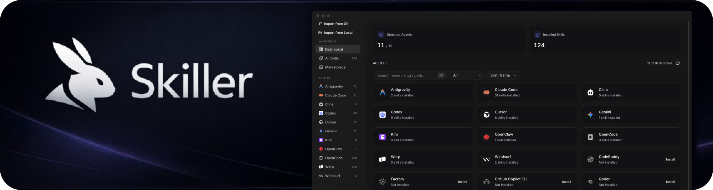
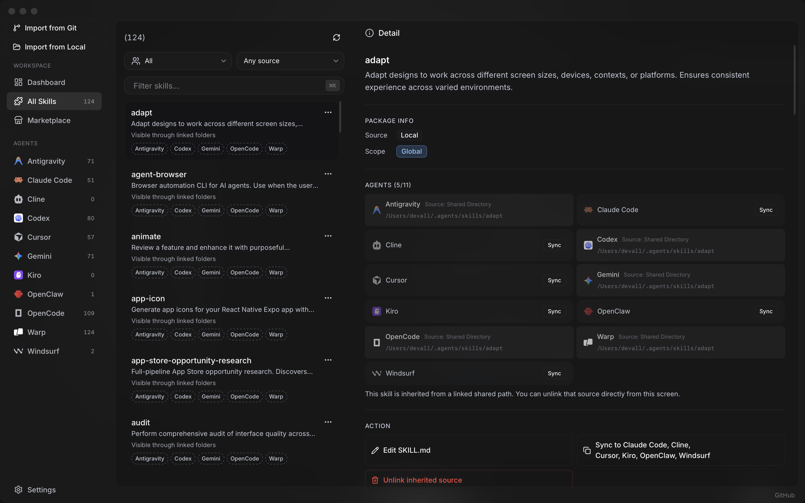
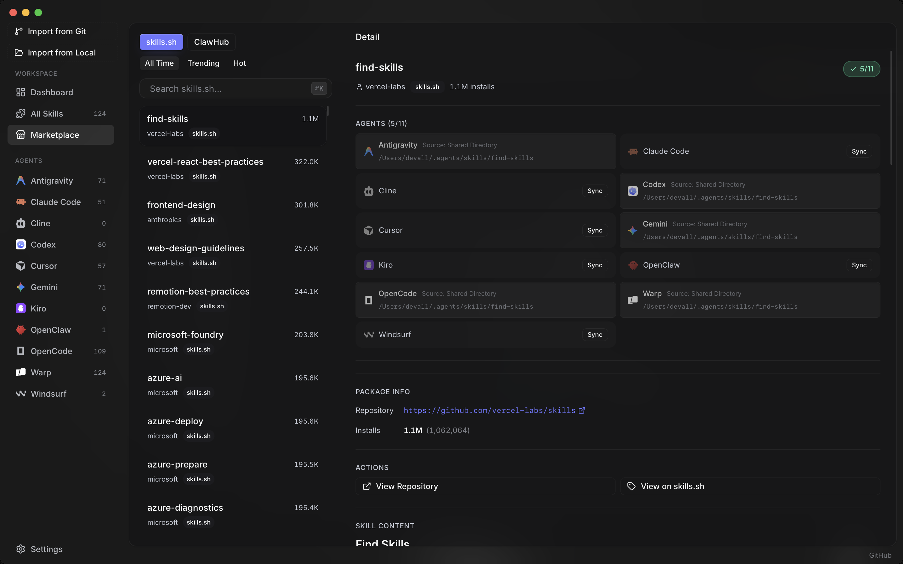
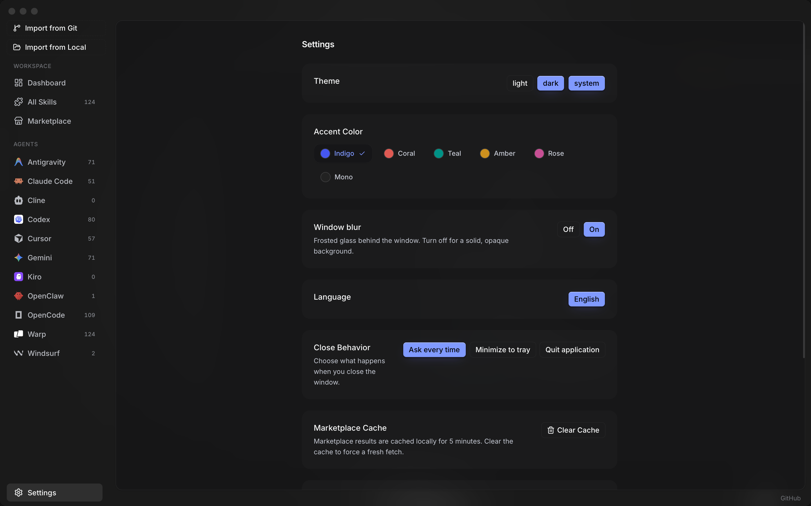

# Skill

<!-- Pink "er": external SVG via img — GitHub's README sanitizer strips inline SVG, so em-sized SVG does not work on github.com. -->

Install, sync, and manage AI agent skills across your coding agents from one desktop app.

## Why Skill

Managing skills separately in every agent is repetitive and error-prone.  
Skill gives you one control center to:

- **See everything at once** — agents, installed skills, and status in one dashboard
- **Install once, sync everywhere** — propagate skills across your agent stack
- **Edit confidently** — update `SKILL.md` content with immediate local visibility
- **Discover faster** — browse marketplace sources like [skills.sh](https://skills.sh) and [ClawHub](https://clawhub.ai)
- **Stay up to date** — refresh and manage skills without manual filesystem work

## Supported agents

Skill talks to every listed agent natively — dropping a skill into one place propagates it to all of them.

<table>
  <tr>
    <td align="center" width="150"><a href="https://docs.anthropic.com/en/docs/claude-code/getting-started"> <b>Claude Code</b></a> CLI</td>
    <td align="center" width="150"><a href="https://help.openai.com/en/articles/11096431-openai-codex-cli-getting-started"> <b>Codex</b></a> CLI</td>
    <td align="center" width="150"><a href="https://google-gemini.github.io/gemini-cli/docs/get-started/"> <b>Gemini CLI</b></a> CLI</td>
    <td align="center" width="150"><a href="https://docs.github.com/en/copilot/how-tos/set-up/install-copilot-in-the-cli"> <b>Copilot CLI</b></a> CLI</td>
    <td align="center" width="150"><a href="https://opencode.ai/docs/"> <b>OpenCode</b></a> CLI</td>
    <td align="center" width="150"><a href="https://docs.openclaw.ai/start/getting-started"> <b>OpenClaw</b></a> CLI</td>
  </tr>
  <tr>
    <td align="center" width="150"><a href="https://www.codebuddy.ai/docs/cli/installation"> <b>CodeBuddy</b></a> CLI</td>
    <td align="center" width="150"><a href="https://docs.qoder.com/cli/quick-start"> <b>Qoder</b></a> CLI</td>
    <td align="center" width="150"><a href="https://cursor.com/docs/cli/overview"> <b>Cursor</b></a> IDE</td>
    <td align="center" width="150"><a href="https://formulae.brew.sh/cask/windsurf"> <b>Windsurf</b></a> IDE</td>
    <td align="center" width="150"><a href="https://formulae.brew.sh/cask/trae"> <b>Trae</b></a> IDE</td>
    <td align="center" width="150"><a href="https://formulae.brew.sh/cask/antigravity"> <b>Antigravity</b></a> IDE</td>
  </tr>
  <tr>
    <td align="center" width="150"><a href="https://kiro.dev/downloads/"> <b>Kiro</b></a> IDE</td>
    <td align="center" width="150"><a href="https://docs.cline.bot/getting-started/quick-start#cli"> <b>Cline</b></a> VS Code extension</td>
    <td align="center" width="150"><a href="https://www.warp.dev/"> <b>Warp</b></a> Terminal</td>
    <td align="center" width="150"><a href="https://factory.ai/"> <b>Factory</b></a> Cloud platform</td>
    <td></td>
    <td></td>
  </tr>
</table>

## Product Tour

### Core experience

- **Dashboard** — system-wide visibility into your skill environment
- **Skills Manager** — inspect, edit, sync, and remove skills
- **Marketplace** — search and install community skills quickly
- **Settings** — configure behavior, sources, and runtime preferences

### Skills Manager

Browse every installed skill, see which agents consume it, edit `SKILL.md` inline, and sync with one click.

### Marketplace

Search `skills.sh` and `ClawHub` in-app, preview a skill's target agents and repository, and install without touching the filesystem.

### Settings

Theme, accent color, window blur, language, close behavior, and cache controls — all in one place.

## Installation

Grab the installer for your OS from the [**latest release**](https://github.com/beautyfree/skiller-skills-desktop-manager/releases/latest):

| OS | File | Notes |
| --- | --- | --- |
| macOS (Apple Silicon) | `stable-macos-arm64-Skiller.dmg` | Signed + notarized — opens with no Gatekeeper warnings. Open the DMG and drag Skill to Applications. |
| Windows (x64) | `stable-win-x64-Skiller-Setup.zip` | Extract and run `Skiller.exe`. SmartScreen may show a one-time warning — click "More info" → "Run anyway". |
| Linux (x64) | `stable-linux-x64-Skiller-Setup.tar.gz` | Extract and run `bin/launcher` from the resulting folder. |

Every release is built and published by the CI matrix in `.github/workflows/release.yml` — tagging `vX.Y.Z` produces all three platforms automatically.

## Auto-updates

Once installed, Skill keeps itself current:

- Checks for new versions on launch, then every 6 hours in the background.
- Downloads delta patches (~14 KB typical) when available; falls back to the full bundle if the patch chain breaks.
- Shows status and a one-click **Restart & install** button in **Settings → App Updates**.

The updater points at `github.com/.../releases/latest/download`, so every tagged release on GitHub automatically becomes the next update for existing installs.

## For Developers

All development, build, and debugging details are in **[docs/DEVELOPMENT.md](docs/DEVELOPMENT.md)**.

## Contributing

Contributions are welcome.  
Open an issue first if you want to discuss a feature or behavior change.

## License

[MIT](./LICENSE)